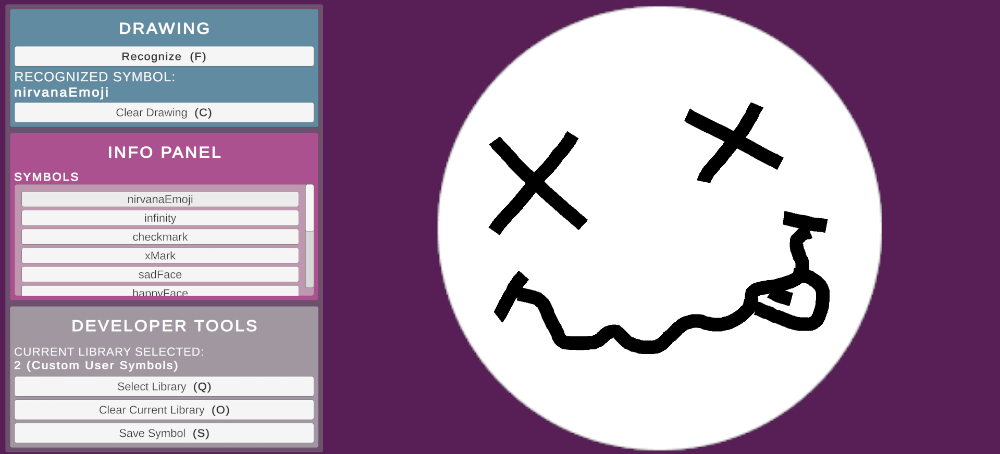

# Drawing Recognition System

Система распознавания 2D-жестов для Unity  

## Описание 
Проект реализует систему распознавания фигур, нарисованных пользователем в Unity.   

## Технологии  
- Unity 2022+  
- C# (8.0)  
- ScriptableObject (настройки)  
- LineRenderer (визуализация рисунка)  
- MVC-архитектура  

## Установка  
1. Клонировать репозиторий
2. Открыть в Unity Hub  
3. Запустить сцену `MainScene`